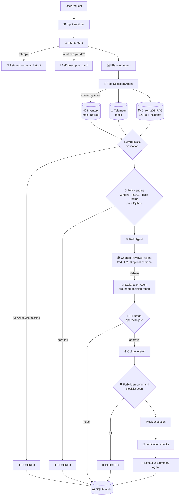

# 🛰️ NetPilot AI

**An explainable, agentic AI change-review board for ISP networks.** Describe a network change in plain English — NetPilot plans it, gathers its own evidence, checks policy, scores risk, debates itself, explains its decision, and waits for a human to approve before anything executes.

> 🔗 **Live demo:** (https://netpilot-ai-609720987965.asia-south1.run.app)
> 🎬 **Demo video:** (https://drive.google.com/file/d/11LvjR4fwhdeENYgvvNTxd2TAokTVUO9-/view?usp=sharing)

---

## What is NetPilot AI?

NetPilot AI is **not a chatbot**. It is a decision engine that behaves like a senior network engineer *plus* the change review board that keeps them honest. Every request — even a one-line instruction — is forced through a full governance pipeline, and the UI renders every stage as a live card so the AI's reasoning is watchable, auditable, and interruptible:

```
User → Intent → Plan → Evidence (agent-chosen tools) → Policy → Risk
     → AI Debate (adversarial review) → Explanation → 🧑‍⚖️ Human approval
     → Execution (mock CLI) → Verification → Audit
```

Ask it something unsafe and it visibly **blocks itself at the right stage** with a grounded explanation. Ask it for a poem and it refuses — it knows it's an operations platform. Ask it *"what can you do?"* and it describes itself straight from its own inventory and policy engine.

## Why is it needed?

Most network outages are not caused by equipment failure — they are caused by **planned changes that missed a dependency**: a VLAN without its DHCP relay, a change outside the maintenance window, a command on the wrong device. The industry's defense is the Change Advisory Board: senior engineers manually reviewing every change against inventory, telemetry, policy, and their memory of past incidents. That process is slow, expensive, inconsistent — and the memory retires with the engineer.

Meanwhile, putting a conventional AI assistant near production infrastructure makes this *worse*, because an LLM that confidently answers is exactly the wrong tool next to a live network. NetPilot inverts the design: **the AI proposes, deterministic code enforces policy, a human approves, and everything is explained and logged.**

## What does it make easy?

| Before | With NetPilot |
|---|---|
| Hours of manual evidence-gathering per change review | ~30 seconds: agents query inventory, telemetry, and the SOP/incident knowledge base themselves |
| Incident lessons living in senior engineers' heads | Past incidents are retrieved from a vector DB and *enforced* — the reviewer escalates any change that resembles a previous failure |
| Post-hoc "why did we approve this?" archaeology | Every decision ships with cited evidence, policies checked, rollback and verification plans — and lands in an audit log with an executive summary |
| Trusting an AI's confident answer | The AI **cannot execute anything**: policy is pure Python, approval is a human click, forbidden commands are scanned out of generated CLI |

The centrepiece is the **🥊 AI Debate**: a second, skeptical reviewer LLM that cross-examines the planner with *real information asymmetry* — the risk scorer sees only technical evidence, while the reviewer alone holds the incident history. In the flagship demo, a migration scored "Low risk" gets raised to "Medium" because the reviewer finds last month's incident report (INC-2419: *"VLAN migration failed — DHCP relay missing on VLAN 220"*) and demands a live DHCP lease test before approval.

## Submitted by

**Chirag Bhatnagar** ([@chiragbhatn](https://github.com/chiragbhatn)) — built for the **OpenAI × NamasteDev Hackathon, July 2026** (Track: AI Agents).

I work in ISP network operations, so this project comes from lived experience: 2 AM maintenance windows, change review meetings, and outages caused not by things breaking but by things *changing*.

## Architecture



### The seven agents

| # | Agent | Job | Temp |
|---|-------|-----|------|
| 1 | Intent | Natural language → strict JSON intent (routes off-topic and help requests) | 0.2 |
| 2 | Planner | Ordered steps, each with a rollback action | 0.2 |
| 3 | Tool Selector | Decides which tools to call and with what queries — the orchestrator executes exactly its output | 0.2 |
| 4 | Risk | Mechanical scoring rubric; outputs base + adders, code re-adds the total | 0.2 |
| 5 | Reviewer ⭐ | Skeptical second opinion over plan + RAG incident evidence; approve / modify / reject | 0.7 |
| 6 | Explainer ⭐ | Grounded decision report; may cite only provided context | 0.2 |
| 7 | Summary | One-paragraph audit entry | 0.2 |

All seven use OpenAI JSON mode with Pydantic validation and one self-correcting retry. A full pipeline run costs well under $0.01 on `gpt-4o-mini`.

### Stack & layout

**Python · OpenAI (`gpt-4o-mini` + `text-embedding-3-small`) · Streamlit · ChromaDB · SQLite · Docker/Cloud Run.** Everything network-side is **mocked** — no real devices are ever touched.

```
netpilot/
  app.py               # Streamlit pipeline UI
  orchestrator.py      # the governance pipeline
  agents/              # 7 LLM agents (strict JSON + Pydantic)
  tools/               # deterministic: inventory, telemetry, policy, execution, verification, audit
  rag/                 # ChromaDB ingestion + retrieval
  guardrails/          # input sanitizer, forbidden-command scanner
  knowledge/           # SOPs, policies, incident reports (the RAG corpus)
  data/                # mock NetBox + telemetry JSON
```

**Mock environment:** 4 devices (Huawei MA5800 OLTs, Catalyst 9300, ASR-9901) · 96 customers (52 premium on OLT-12 — the migration cohort) · OLT-12 uplink at 83% · VLANs 100/150/200/220/300/400 provisioned, 999 deliberately absent · incident INC-2419 seeded in the knowledge base to power the debate.

## How to run it

### Locally

```bash
git clone https://github.com/chiragbhatn/<THIS-REPO>.git
cd <THIS-REPO>
pip install -r requirements.txt
cp .env.example .env          # add your OPENAI_API_KEY
streamlit run app.py
```

The knowledge base auto-ingests into ChromaDB on first run. Headless test of the three demo paths (happy / nonexistent VLAN / outside window): `python scripts/smoke_test.py all`.

### Try these prompts

1. `what all can this app do?` — the platform describes itself
2. `Migrate all premium customers on OLT-12 to VLAN 220 during tonight's maintenance window.` — full pipeline + AI debate (sidebar: role **approver**, window toggle **ON**)
3. `Move the premium customers on OLT-12 over to VLAN 999 tonight.` — blocks at Evidence
4. `Delete VLAN 200 on SW-01 immediately.` — blocks at Policy
5. `write me a poem` — refused: not a chatbot

### Deploy to Google Cloud Run

The repo ships a `Dockerfile`. Console → Create service → *Continuously deploy from repository* → this repo → memory **1 GiB** → allow unauthenticated → add env var `OPENAI_API_KEY` → Create. Or:

```bash
gcloud run deploy netpilot --source . --region asia-south1 --memory 1Gi \
  --allow-unauthenticated --set-env-vars OPENAI_API_KEY=<your-key>
```

*Cloud Run's filesystem is ephemeral — the audit log and vector index reset on new instances (fine for a demo).*

## What's next

- Real southbound drivers (NETCONF/gNMI, vendor APIs) behind the same approval gate
- Post-incident learning loop: verification failures auto-write new incident docs into the RAG corpus
- Multi-approver workflows + Slack/Teams approval gate
- Fine-tuned reviewer on the operator's own incident history

---

*All network behavior is simulated; the governance is real.*
